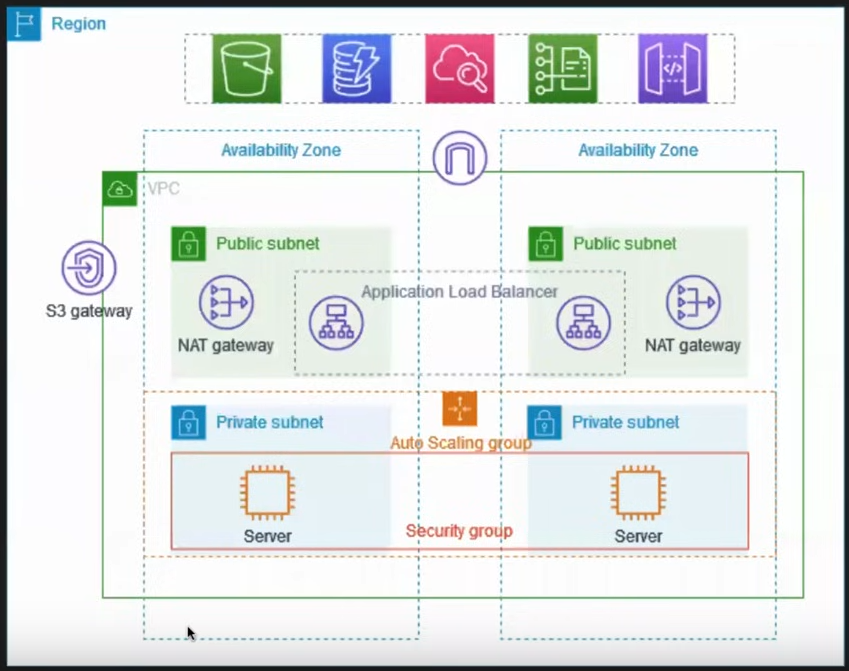

# How to setup VPC in AWS

### prerequisite: 
 - computer-networking

## Overview
- setup VPC in two availability zones (for safety)
- each VPC will have a private and a public subnet
- each public subnet contains a NAT gateway and a load balancer node
- the servers running in a private subnet are launched and terminated by using an auto scaling group and receive traffic from the load balancer
- the servers can connect to the internet by using the NAT gateway

