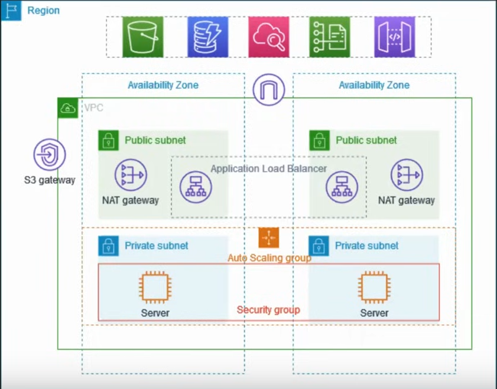

# Project Description

### prerequisite:
 - AWS account 
 - theoritical comception of computer networking and aws VPC components

## Project_1:
- reference: https://docs.aws.amazon.com/vpc/latest/userguide/vpc-example-private-subnets-nat.html

- In this project we are going to setup VPC and all the other components that can be used in a production environment.
- To improve resiliency, we are going to deploy the serves in two availability zones by using an auto scaling group and an application load balancer. For additional security we are going to deploy the server in private subnet. The server receive requests through the load balancer. The server can connect to the internet by using a NAT gateway. To improve resiliency, we are going to deploy the NAT gateway in both availability zones.

