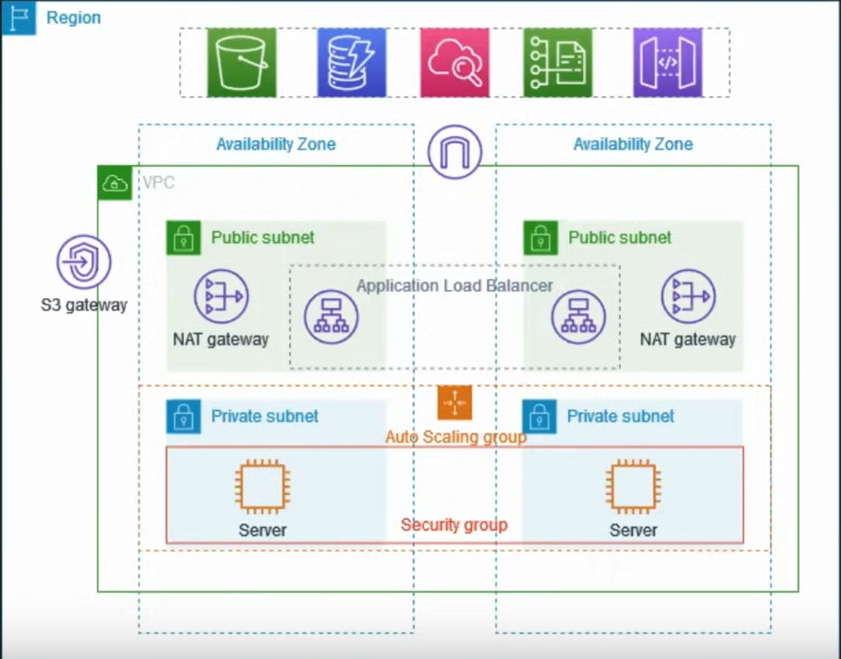
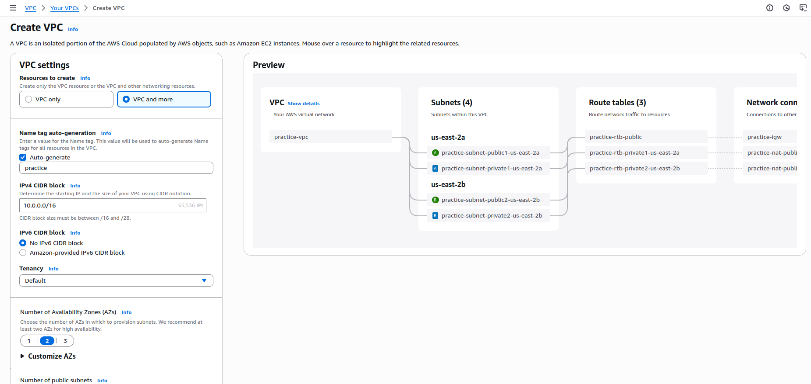
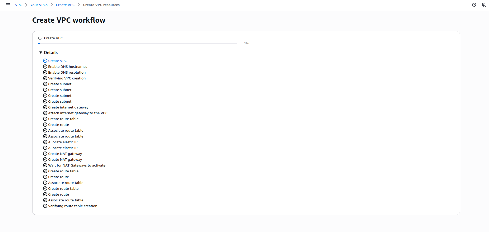

# Setting Up VPC in aws
In this project we are going to 
- setup a VPC in aws in two availability zone : it is a good practice and also for safety to setup VPC in two availability zones (or two data centers)
- each VPC will have public and private subnet
- each public subnet contains a NAT and an application load balancer
- deploy two ec2 instances in each private subnet
- the instances running in a private subnet are launched and terminated by using an auto scaling group and receive traffic from the load balancer

---
---

# Stage 1: Setting up VPCs and subnets
## Step 1: login to aws and open create a new VPC

select `VPC and more`, the other option `VPC only` comes without any extra public networking setup,No internet-facing endpoint etc. so you have to setup everything

- NAT gateway will have the elastic IP address
