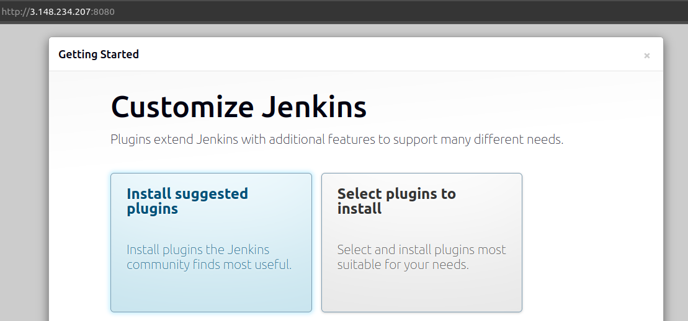

# How to setup Jenkins ?

# steps:
1. Create a ec2 machine in aws and ssh into it
2. Install Jenkins: https://www.jenkins.io/doc/book/installing/linux/

    - install java:
    ```bash
    sudo apt update
    sudo apt install fontconfig openjdk-21-jre
    java -version
    ```
    expected output:
    ```bash
    openjdk version "21.0.3" 2024-04-16
    OpenJDK Runtime Environment (build 21.0.3+11-Debian-2)
    OpenJDK 64-Bit Server VM (build 21.0.3+11-Debian-2, mixed mode, sharing)
    ```

    - install jenkins (LTS):
    ```
    sudo wget -O /etc/apt/keyrings/jenkins-keyring.asc \
        https://pkg.jenkins.io/debian-stable/jenkins.io-2023.key
    ```
    ```
    echo "deb [signed-by=/etc/apt/keyrings/jenkins-keyring.asc]" \
        https://pkg.jenkins.io/debian-stable binary/ | sudo tee \
        /etc/apt/sources.list.d/jenkins.list > /dev/null
    ```
    ```    
    sudo apt-get update
    sudo apt-get install jenkins
    ```

    - verify jenkins installation:
    ```
    systemctl status jenkins
    ```
    expected output:
    ```
    jenkins.service - Jenkins Continuous Integration Server
     Loaded: loaded (/usr/lib/systemd/system/jenkins.service; enabled; preset: >
     Active: active (running) since Sat 2025-08-02 13:17:37 UTC; 1min 16s ago
   Main PID: 4185 (java)
    ```
    - to make sure jenkins auto restart incase out server restart 
    ```
    sudo systemctl enable jenkins
    ```

3. Access Jenkins via browser

- `url`: `public_ip_address:8080`


Initially I will ask for a default password, so let's get that from the server.
```
sudo cat /var/lib/jenkins/secrets/initialAdminPassword
```
expected output:
```
wrw42oonsoe303rworw3902
```
4. Setup Jenkins



Here we are going to pick install suggested plugins


