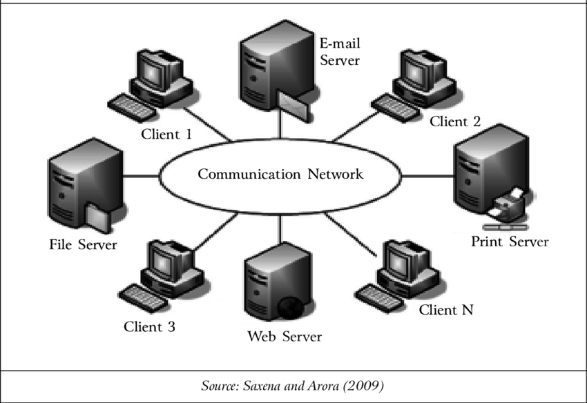
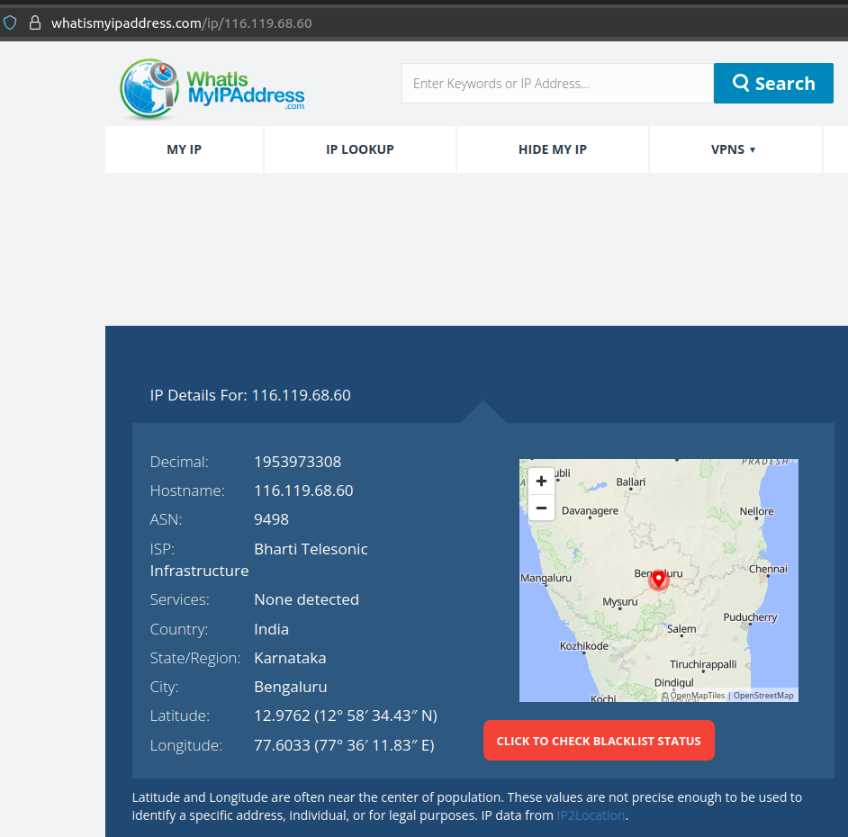
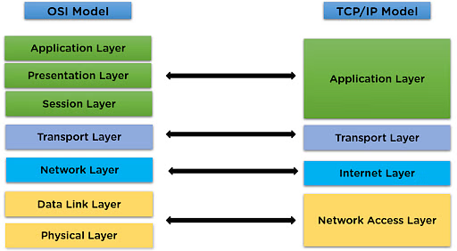
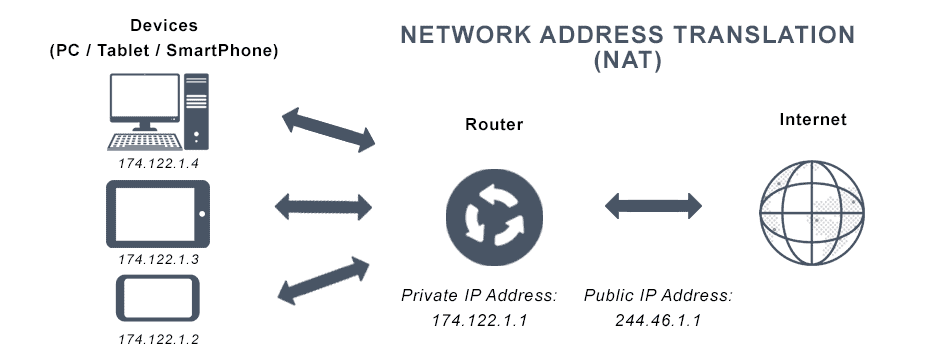

# Computer Networking
A computer network is a system of interconnected computing devices (computer, printer, servers, routers etc) that can access data and share resources via communication medium and protocols.



# Tracing back Netflix.com




# OSI (Open Systems Interconnection) Model
- Open System Interconnection model is a conceptual framework that standardlize how different computer system communicate with each other over a network.
- It is comprise of 7 layers:

| Layer | Name             | Function                                              | Examples                       |
| ----- | ---------------- | ----------------------------------------------------- | ------------------------------ |
| 7     | **Application**  | End-user interface; provides services to applications | HTTP, FTP, DNS, SMTP, POP3     |
| 6     | **Presentation** | Translates data formats; encryption, compression      | SSL, JPEG, ASCII, MPEG         |
| 5     | **Session**      | Manages sessions/connections between apps             | NetBIOS, RPC, SQL session      |
| 4     | **Transport**    | Ensures reliable delivery (or not); flow control      | TCP, UDP                       |
| 3     | **Network**      | Routing and addressing across networks                | IP, ICMP, IPSec, IGMP          |
| 2     | **Data Link**    | Frame transfer between devices; error detection       | Ethernet, MAC, PPP, Switches   |
| 1     | **Physical**     | Physical medium, cables, signals                      | Cables, Hubs, Wi-Fi, Bluetooth |

- Memonic to remember the layers:
`A`ll `P`eople `S`eem `T`o `N`eed `D`ata `P`rocessing

- 📦 Real-World Example: Sending an Email
    - **Application** (7): You write the email (SMTP)
    - **Presentation** (6): It’s encoded in ASCII
    - **Session** (5): A session is created between your mail client and server
    - **Transport** (4): TCP breaks it into segments, ensures delivery
    - **Network** (3): IP adds sender and receiver IPs for routing
    - **Data Link** (2): Ethernet adds MAC addresses, error checking
    - **Physical** (1): Bits are sent over Wi-Fi or Ethernet cable

- Layers 1–4 (Lower layers): Focus on data transmission.
- Layers 5–7 (Upper layers): Focus on application-specific processing.


## TCP/IP Layer
- TCP/IP (Transmission Control Protocol/ Internet Protocol) is a simplified and a practical version of the OSI model.
- It has 4 layers and maps OSI model like this:

| TCP/IP Layer          | Corresponding OSI Layers | Description                                       | Examples                       |
| --------------------- | ------------------------ | ------------------------------------------------- | ------------------------------ |
| **4. Application**    | OSI Layers 5, 6, 7       | User-facing software, data formatting, sessions   | HTTP, HTTPS, FTP, SMTP, DNS    |
| **3. Transport**      | OSI Layer 4              | Ensures data delivery between systems             | TCP, UDP                       |
| **2. Internet**       | OSI Layer 3              | Handles addressing and routing across networks    | IP, ICMP, ARP, IGMP            |
| **1. Network Access** | OSI Layers 1 & 2         | Manages physical data transfer and link protocols | Ethernet, Wi-Fi, MAC, PPP, DSL |

- Memonic to remember the layers:
`A`ll `T`ransmission `I`nternet `N`eeds





# IP Address
- Internet Protocol (IP) Address is a unique identifier given to each devices on a network that uses the internet protocol for the communication.
- Types of IP address:
    - IPv4:
        - format: 192.168.0.1 (4 numbers separated by dots each from 0-255 `8 bits`)
        - 32 bit address: → allows ~4.3 billion addresse
        - 
    - IPV6:
        - format: 2001:0db8:85a3:0000:0000:8a2e:0370:7334
        - 128 bit address → allows 340 undecillion addresses
        - Needed because IPv4 addresses are running out


# IP Address Class
- In the traditional networking system, IPv4 address are organized into 5 different classes based on how many hosts (devices) or networks they supports.
- Now, it is replaced by CIDR.
- The IPv4 classes are determined based on the range of the first octet of the IP address.
- In the below figure you can clerly see that the class A has first octet of range 1-126, and class B starts from 128 to 191.
- Here, the value 127 is a special case in IPV4.
    - 127.x.x.x is reserved for loopback which means any data sent to this address never leaves the machine from where it is being sent, so basically the data loop back to the same machine.
    - One of the most common loopback address is `127.0.0.1` i.e localhost
- Another special IP address is 0.0.0.0 specifically means “unspecified address”


- In class A, the first octet is used for network and is ranging for 1-126, so it has 126 total distinct network whereas remaining 3 octets are used for hosts/devices. So basically, each network of this class can have 2^24 hosts.
- Similarly, Class B has first octet range `10000000` - `10111111` (i.e 128-191), here we can see that first two bits are fixed. So this class will have 2^(16-2) = 2^14 networks and 2^16 - 2 hosts (we are subtracting 2 because the first address is the network address itself and the last address is the broadcast address)
- Similarly, Class C has first three bits fixed `110`, so has 2^21 distinct networs and 2^8 - 2 distinct hosts.

- Usages:
    - Class A is used for a large organization
    - Class B is used for medium network
    - Class C is used for Home/small business network 

# CIDR (Classless Inter-Domain Routing)
- CIDR is a modern way of organizing IP addresses without being depending on the static class based grouping. 
- Unlike in classed based IP addresses, in CIDR, we can explicitly choose how many bits can be used for the network and how many are used for host.
- Notation: `x.x.x.x/<prefix bit length>`
- For example:
```
192.120.0.10/16
```
where:
- `192.120.0.10` -> network address
- /16 -> number of prefix bit length that is used for the network part.
so /16 means:
    - first 16 bits are for networks
    - remaining 16 bits are for hosts

## why CIDR ?
- **More efficient IP allocation** → No wasting huge chunks of addresses.
- **Flexible subnetting** → You can make networks of any size (e.g., /27, /29) instead of being stuck with Class A/B/C sizes.
- **Better routing** → ISPs can “aggregate” routes and reduce internet routing table size.

Example:
- If we only need 20 hosts we can use CIDR like this:
```
192.168.1.0/27
```
- Here it says that first 27 bits are used for networks and remaining 32-27 = 5 bits are used for host which is 2^5 = 32. Since we reserve first and last address for netowork and broadcast. Thus, 30 distinct usable hosts addresses.

## Note:
- with CIDR like 192.168.1.50/27, the number before the slash is just any IP address inside that subnet, not necessarily the network address.
- What happens if you give 192.168.1.50/27
    - The /27 tells you the subnet mask.
    - .50 is just one host inside that subnet.
    - Networking devices will internally understand it as belonging to the 192.168.1.32/27 network.


# SubNetting
- Subnetting is the process of diving the large IP address into a group of smaller and more managable networks (subnets) by borrowing bits from the host portion.

## Why Subnetting?
- **Efficient use of IP addresses**: Avoids wasting a huge block when you only need a few hosts.
- **Improved performance**: Smaller broadcast domains = less broadcast traffic.
- **Security & organization**: Isolate departments, floors, or buildings.
- **Geographic separation**: Different office locations, each with its own subnet.

- **For example**:
    - Original Class C network: 192.168.1.0/24 → 254 usable hosts.
    - We subnet into /26 → 64 addresses per subnet (62 usable) and since we took 2 bits from host thus 2^2 = 4 subnets.

    ```
    192.168.1.0/26     → Usable: .1 – .62
    192.168.1.64/26    → Usable: .65 – .126
    192.168.1.128/26   → Usable: .129 – .190
    192.168.1.192/26   → Usable: .193 – .254
    ```

- Number of subnets = 2^(borrowed bits)
- Hosts per subnet = 2^(remaining host bits)−2

- Note that all devices within the same subnet can communicate directly without a router.


# SubNet Mask
- A subnet mask is a 32 bits number which tells which part of the IPv4 address is the network and which is the host.

- Example:
```
IPV4 address:  192.168.1.10
Mask:      255.255.255.0
inary IP: 11000000.10101000.00000001.00001010
Binary MS: 11111111.11111111.11111111.00000000
```
- Network bits → 1s in the mask
- Host bits → 0s in the mask

- Think of it as a filter — it “masks” the network part so devices know which IPs are in the same subnet

# NAT (Network Address Translation)
- NAT is a networking technique where the source or destination IP address of data packets are changed as they pass through.
- NAT helps to increase the network security by hiding the IP address of the devices within a private network by replacing it with a different IP address to the internet.
- It’s most commonly used to let many devices in a private network share one public IP address.

## Why NAT exists
- `IPv4 addresses are limited` — only ~4.3 billion exist.
- `NAT` allows private IP ranges (like 192.168.x.x, 10.x.x.x) to connect to the internet through a single public IP.
- `Adds a layer of security` — outside devices can’t directly see your internal devices.




## How it works (basic home example)

- Your laptop has a private IP (e.g., 192.168.1.10).
- You request https://google.com.
- The router replaces your private IP with its public IP (e.g., 203.0.113.5) before sending it to the internet.
- When Google responds, the router remaps the public IP back to your private IP and sends it to you.

📌 Types of NAT
- **SNAT (Source NAT)**: Changes the source IP in outbound traffic. Common for internet access.
- **DNAT (Destination NAT)**: Changes the destination IP for inbound traffic (e.g., port forwarding).
- **PAT (Port Address Translation)**: A form of NAT where multiple devices share a single public IP by mapping connections to different port numbers — often called NAT overload.


# Network Address
- The first IP Address in a subnet.
- All host bits are 0 in binary.
- Used to identify the subnet itself — not assignable to any device.

# Broadcast Address
- The last IP in a subnet.
- All host bits are 1 in binary.
- Used to send data to all devices in the subnet at once.
- Devices listen for packets sent to the broadcast address.

Example for 192.168.1.0/24:
```
Network ID:  192.168.1.0     ❌ (reserved)
Usable:      192.168.1.1 → 192.168.1.254 ✅usable for devices
Broadcast:   192.168.1.255   ❌ (reserved)
```