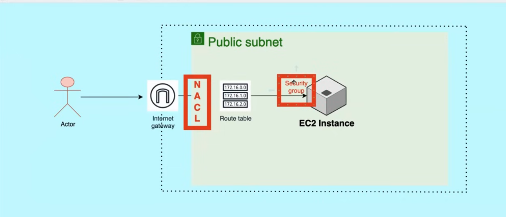

# VPC (Virtual Private Cloud)

# Internet Gateway

# Public Subnet

# Load Balancer

# Route Table

# Private Subnet

# Security Groups
- instance level security
- inbound and outbound rules
- what ips are allowed

# NACL (Network Access Control List)
- subnet level security
- what ips are allowed or denied

# NAT

# Auto Scaling Group

# Load Balancer

# Target Group

# Bastion Host or Jump Server
