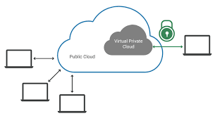
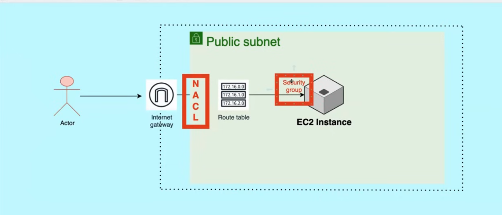

# VPC (Virtual Private Cloud)

- Virtual Private cloud is a logically isolated section of the public cloud network where you can setup private network environment for app deployment
- This virtual network closely resembles a traditional network that you'd operate in your own data center, with the benefits of using the scalable 
## keypoints:
- **Isolation** – Your resources (servers, databases, etc.) in the VPC are logically separated from other customers’ resources.

- **Custom network configuration** – You choose the IP address space, subnet layout, and routing.

- **Security control** – You use firewalls, network ACLs, and security groups to decide who can talk to what.

- **Connectivity** – You can connect your VPC to the internet, other VPCs, or your on-premises network via VPN or dedicated lines. 


# public Subnet
- A subnet is a range of IP addresses in your VPC
- A public subnet can directly communicate with the internet meaning resources in it can send traffic to the internet and receive incoming connections from the internet (if security rules allow). 
- For instance, if you app is hosted in an ec2 instance in a public subnet then you can directly access the application through the internet
- A subnet is a public subnet if 
    - Route table has a route to an Internet Gateway (IGW)
    - Instances have public IPs or Elastic IPs assigned

```
[ Internet ]
     ↑ ↓
[ Internet Gateway ]
     ↑ ↓
[ Public Subnet ] → Public IPs → EC2 / ALB
```
- public subnet is typically used for 
    - hosting web server or API that are meant for public access
    - hosting bastion host or load balancer

# Private subnet
- A subnet which can not be directly access from the internet is called private subnet
- A subnet is a public if
    - No direct inbound internet access, except using a bastion host or a jump server
    - route tabel has a route to NAT getway (outbound only)
```
[ Private Subnet ] → NAT Gateway → Internet (outbound only)
```
- typically used for 
    - hosting db or services what do not meant for direct public access

- Note that, AWS VPC networking allows private IP communication between any two instances in the same VPC, regardless of public/private subnet. 
- So two server in a same VPC but in a public and private subnet can communicate with each other if
    - Security groups / NACLs allow traffic
    - routable allows it

# An Internet Gateway 
- A gateway is basically a component that allows communication between two components
- An Internet is a VPC component that allows communication between VPC and the internet
- It does not cause availability risks or bandwidth constraints on your network traffic.
- An internet gateway enables resources in your public subnets (such as EC2 instances) to connect to the internet if the resource has a public IPv4 address or an IPv6 address. Similarly, resources on the internet can initiate a connection to resources in your subnet using the public IPv4 address or IPv6 address

# Load Balancer
- A load balancer is a tool or component in VPC that distributes the incomming traffics across multiple available servers so that no single server gets **overwhelmed**, improving **availability**, **performance**, and **falult tolerance**. 

- Different types of Elastic Load Balancer (ELB) are :
    - Application Load Balancer (ALB):
        - Works at Layer 7 (HTTP/HTTPS), can route based on URLs, headers, etc.
    - Network Load Balancer (NLB):
        - Works at Layer 4 (TCP/UDP), super fast, great for low-latency workloads.
    - Gateway Load Balancer (GLB):
        - Routes traffic to 3rd-party appliances like firewalls

# Route Table
- A route table in aws is a set of rules that tell your VPC's network where to send traffic based on destination IP address
- Keypoints:
    - Every subnet in AWS must be associated with a route table if not then VPC's main route table will be used
    - Each route = Destination + Target
        - Destination = IP range to match (e.g., 10.0.0.0/16, 0.0.0.0/0)
        - Target = Where to send matching traffic (e.g., local, Internet Gateway, NAT Gateway, Peering connection, Transit Gateway)

> Both security Groups and NACL are used to control traffic, but they works at different level and behave differently
># Security Groups
>- **level**: works at instance level
>- **stateful**: If the traffic is allowed in then the return traffic is automatically allowed out (and vice-versa)
>- **direction**: you define separate **inbound**(incomming traffic) and **outbound**(outgoing traffic) rules
>- **rule**: **Allow** rule only (no explicit **deny** rule)
>- **scope**: attached directly to the ec2 instance, load balancer etc

># NACL (Network Access Control List)
>- **level**: works at subnet level
>- **Stateless**: Return traffic must be explicitly allowed by the rule
>- **direction**: separate inbound and outbound rule
>- **rule**: both **allow** and **deny** rule
>- **Scope**: applies automatically to all the resources in the subnet

Analogy:
- **Security Group** = a doorman for each apartment (instance) — decides who can visit your specific unit.
- **NACL** = a gate at the apartment complex entrance (subnet) — can block or allow people before they even get to your building.




# NAT (Network Address Translation)
- NAT is a networking technique where the source or destination IP address of data packets are changed as they pass through.
- NAT helps to increase the network security by hiding the IP address of the devices within a private network by replacing it with a different IP address to the internet.
- It’s most commonly used to let many devices in a private network share one public IP address.


# Auto Scaling Group (ASG)
- An Auto Scaling Group is a service that automatically manages a group of EC2 instances to ensure that your application has a number of healthy servers running to handle current load.
- What it does
    - Automatically adds or removes instances based on rules you define (like CPU usage, network traffic, or a schedule).
    - Keeps a minimum number of instances running to ensure availability.
    - Replaces unhealthy instances automatically to keep your app healthy.
    - Works together with Launch Templates/Configurations that specify how to create new instances (AMI, instance type, security groups, etc.).

# Target Group
- A target group in aws is a logical grouping of resources(ec2 instances, IP addresses, Lambda functions) that a load balancer routes traffic to.
- What it does:
    - Defines where the load balancer sends incoming traffic.
    - Monitors the health of targets using health checks.
    - Supports different protocols (HTTP, HTTPS, TCP) depending on the load balancer type.

# Bastion Host or Jump Server
- A bastion host (also called a jump server) is a special server designed to securely access servers inside a private network or private subnet.
- Note: you can’t SSH or RDP to a server running on private network or subnet directly from the internet